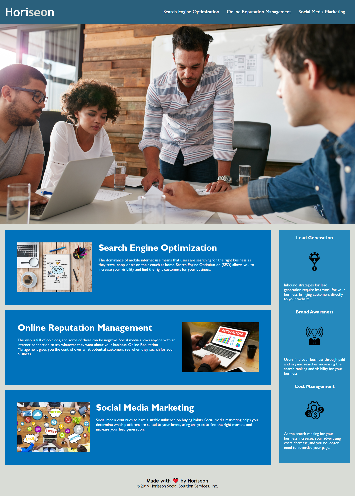

# Horioseon-Refactor
The basis of this project was to refactor code in compliance with accessibility standards.

Actions performed within this project:
- An appropriate application title was added.
- HTML was restructured in a logical format which flowed regardless of styling.
- Broken links in the HTML were fixed.
- Alternative text was added to images for accessibility.
- CSS was condensed for simplicity.
- Appropriate comments added to CSS for understanding.

Below you will find a screenshot and a link to the deployed application.

Horiseon link:  https://gkal14.github.io/Horiseon-Refactor/